# Event Modeling: O que é e para que serve?

## Motivação

### Lei de Moore 

Os Sistemas de Informação Digitalizados são um conceito relativamente novo. Os humanos trabalham com sistemas de informação há milhares de anos. Ao longo dos séculos, bancos, seguradoras e muitas outras organizações de grande escala conseguiram ter sucesso.

Com o advento do transistor, a velocidade e a precisão do processamento de informações aumentaram em ordens de magnitude. O que não ganhou o mesmo salto quântico é o armazenamento digital. Esse desequilíbrio fez com que os sistemas de informação fossem otimizados para uma quantidade muito pequena de informações online. Você pode ver isso no advento da tecnologia RDBMS. O que isso significa é que o compromisso era jogar informações fora.

### Memória Humana

Contar histórias é algo que permite ao ser humano passar conhecimento para as gerações subsequentes e depende muito de como armazenamos memórias - sejam lógicas, visuais, auditivas ou outras. Isso é importante porque há um paralelo com a forma como os sistemas de informação foram construídos. Há uma “memória” de todas as suas visitas ao médico. É o livro de registros dos formulários que são preenchidos a cada visita.

Especificações por exemplo são uma maneira de mostrar como algo deve funcionar. Isso pode ser visto em práticas bem-sucedidas em software, como o Behavior Driven Development. Isso funciona bem porque nos comunicamos por histórias de forma mais eficaz. Ele se relaciona com a narrativa como uma forma de manter a informação na sociedade. Nossos cérebros são construídos para isso mais do que para fluxogramas e outros formatos.

### A vida após o alvorecer da era do computador

Nas últimas décadas, a Lei de Moore do lado do armazenamento online alcançou. Isso significa que, após as primeiras décadas vivendo com sistemas de computador, nossos sistemas de informação que agora são digitalizados podem usar a mecânica que os tornou eficazes ao longo da história.

Isso significa que temos armazenamento suficiente para não jogar informações fora. A capacidade de poder manter um histórico de tudo o que aconteceu permite que os sistemas sejam mais confiáveis por meio de auditoria e especificação por exemplo que se traduz literalmente em como o sistema é implementado.

Também temos armazenamento suficiente para ter um cache de diferentes visualizações sobre o que aconteceu no sistema. Isso é importante, pois agora tornamos a tarefa de tentar encaixar todas as nossas preocupações em um modelo uma restrição desnecessária. Em 1956, um disco rígido da IBM que armazenava 10 MB custava US$ 1 milhão e exigia um orçamento mensal de US$ 30 mil.

### A Realidade das ferramentas atuais

Portanto, agora estamos em uma encruzilhada em que temos ferramentas muito maduras, mas essas ferramentas são feitas para resolver um problema que não temos mais - ser eficiente com restrições de armazenamento. O novo ferramental que vemos em ascensão é o que os sistemas de informação sempre tiveram: um livro-razão do que aconteceu - o armazenamento não é mais um problema importante. Há muitos benefícios em manter o livro-razão. Eles representam a maneira natural como pensamos sobre os sistemas - digitais ou não.

### O modelo que funciona

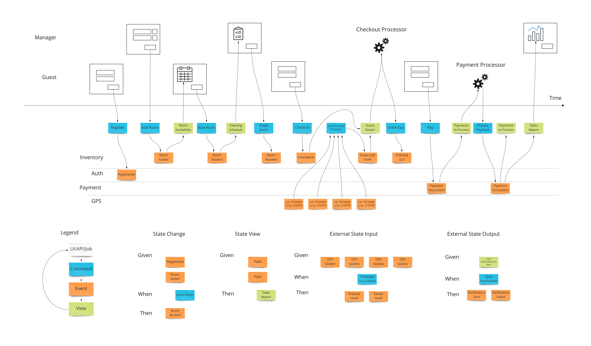

O tempo é um conceito que agora é uma peça central na descrição de um sistema. Os componentes e classes que vimos na computação não são tão importantes. Podemos mostrar, por exemplo, o que um sistema deve fazer do início ao fim, em uma linha do tempo e sem ramificações - novamente para fazer uso desse aspecto de memória de nossos cérebros. Este é o Modelo de Evento. Ele é usado para seguir todos os valores de campo na interface do usuário para o armazenamento desses valores para onde eles finalmente terminam em um relatório ou tela. Geralmente é feito com post-its em uma parede ou quadro branco - ou uma versão online de um quadro branco. Veremos que a simplicidade está no centro da abordagem, pois usaremos apenas 3 tipos de blocos de construção, bem como wireframes ou maquetes tradicionais. Além disso, para manter as coisas simples, contaremos com apenas 4 padrões de como estruturamos o diagrama.

### Simplicidade

Quando queremos adotar certas práticas ou processos para ajudar uns aos outros a entender e se comunicar, isso é inversamente proporcional à quantidade de aprendizado que os indivíduos devem fazer para serem proficientes nesses métodos. Dito de outra forma, se uma organização optar por adotar um processo chamado “X”, e X requer um livro e um workshop que leva uma semana para ser concluído, isso anula a eficácia de X, e aqui está a pior parte, não importa o quão bom X é.

Quando o livro for leitura obrigatória para as pessoas de uma organização, todos dirão que o leram; apenas metade o terá realmente lido; metade deles alegará que o entenderam; e apenas metade deles o terá entendido; e metade deles poderá aplicá-lo.

É por isso que a Modelagem de Eventos usa apenas 3 peças móveis e 4 padrões baseados em 2 ideias. Leva alguns minutos para explicar e o restante do aprendizado é feito na prática, de forma transparente, onde quaisquer deficiências no entendimento até mesmo daquelas poucas ideias centrais são rapidamente corrigidas.

É assim que se chega a um entendimento em uma organização.

### Eventos

Digamos que queremos criar um site de hotel para uma rede de hotéis para permitir que nossos clientes reservem quartos on-line e para agendarmos a limpeza e quaisquer outras preocupações do hotel. Podemos mostrar quais eventos, ou fatos, estão armazenados em uma linha do tempo do ano naquele negócio. Podemos fingir que já temos o sistema e nos perguntar quais fatos foram armazenados à medida que avançamos no tempo.

### Wireframes

Para trazer a parte visual da narrativa, mostramos wireframes ou maquetes de páginas da web na parte superior. Estes podem ser organizados em raias para mostrar pessoas diferentes (ou às vezes sistemas) interagindo com nosso sistema. Também mostramos qualquer automação aqui com um símbolo como engrenagens para ilustrar que o sistema está fazendo algo. Isso tem um conjunto fácil de entender de mecânica de uma lista de tarefas que um processo vai e faz e marca os itens como concluídos. Em nosso exemplo de hotel, pode ser um sistema de pagamento ou um sistema de notificação.

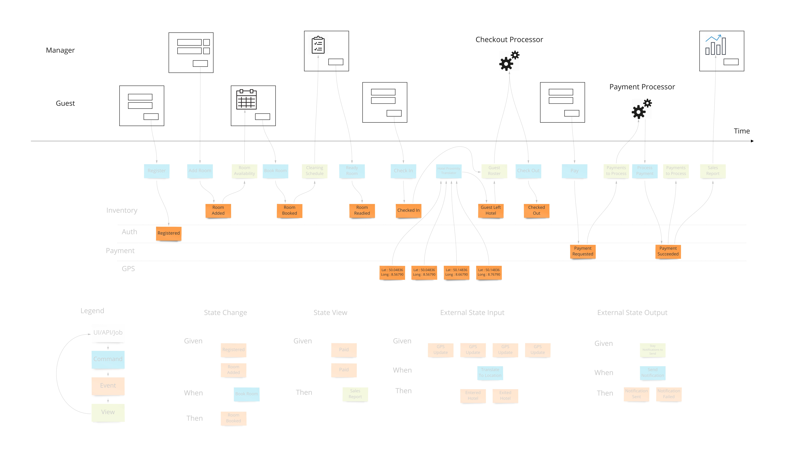

Neste ponto, temos o suficiente para poder projetar alguns sistemas com algumas pessoas de UX/UI. Mas há 2 peças muito fundamentais que devem ser adicionadas ao projeto que mostram 2 características principais de qualquer sistema de informação: Capacitar o usuário e informar o usuário.

### Comandos

A maioria dos sistemas de informação deve permitir que um usuário afete o estado do sistema. No nosso exemplo, devemos permitir a reserva de um quarto para alterar o sistema para que não façamos over-book e quando essa pessoa chegar nessa data futura, tenha um quarto pronto para ela.

As intenções de alterar o sistema são encapsuladas em um comando. Ao contrário de simplesmente salvar os dados do formulário em uma tabela em um banco de dados, isso nos permite ter uma maneira não técnica de mostrar as intenções, permitindo qualquer implementação - embora algumas tenham vantagens, como veremos.

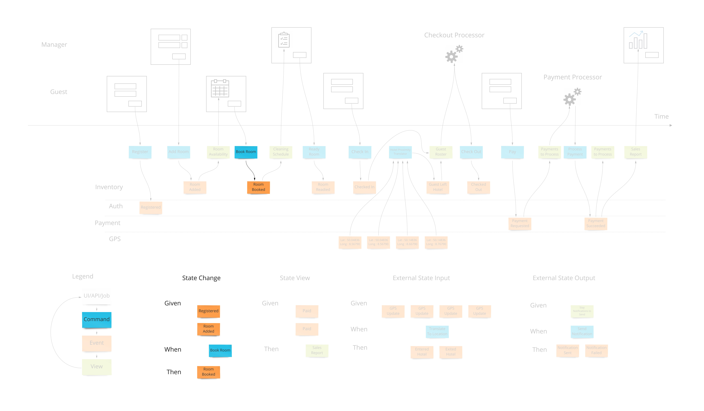

Do ponto de vista da interface do usuário e da experiência do usuário, isso gera uma “UI baseada em comandos”, que ajuda muito a criar UIs que podem ser compostas. Com esse padrão, fica muito mais claro quais são os limites transacionais, tanto do ponto de vista técnico quanto do comercial. O hóspede do hotel registrou-se com sucesso ou não.

Quando há nuances sobre quais são os pré-requisitos para que um comando seja bem-sucedido, eles são elaborados nas especificações de estilo “Given-When-Then”. Esta é, novamente, uma maneira de contar uma história de como é o sucesso. Pode haver algumas dessas histórias para mostrar como um comando pode ou não ser bem-sucedido.

Um exemplo pode ser “Dado: Registramos e adicionamos um método de pagamento, Quando: Tentamos reservar um quarto, Então: um quarto está reservado”. Essa forma de especificação também é chamada de “Arrange, Act, Assert” e no mundo UX/UI “Situation, Motivation, Value”.

### Views (ou Modelos de Leitura)

A segunda parte de qualquer sistema de informação é a capacidade de informar o usuário sobre o estado do sistema. Nosso hóspede do hotel deve saber quais dias estão disponíveis para determinados tipos de quartos nos quais está interessado em ficar. Geralmente, há muitos deles e suportam o aspecto multimodelo dos sistemas de informação.

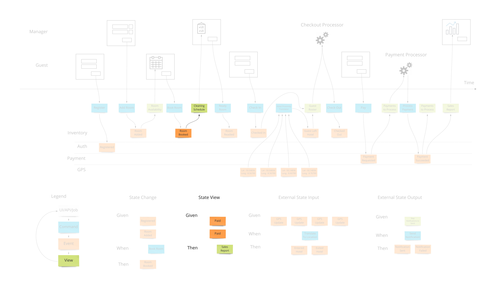

A view no sistema foi mudando à medida que novos eventos foram sendo armazenados. Em nosso sistema hoteleiro, essa visualização do calendário estava sendo atualizada à medida que novos eventos que afetavam o estoque aconteciam. Outras exibições podem ser para a equipe de limpeza ver quais quartos estão prontos para serem limpos, pois os eventos sobre o check-out dos hóspedes estão sendo armazenados.

Especificar como uma visualização se comporta é muito semelhante à maneira como especificamos como aceitamos comandos com uma diferença. As visualizações são passivas e não podem rejeitar um evento depois de armazenado no sistema. Temos “Dado: o hotel está configurado com 12 quartos com vista para o mar, o quarto com vista para o mar foi reservado de 4 a 12 de abril X 12, Então: o calendário deve mostrar todas as datas, exceto 4 a 12 de abril para disponibilidade com vista para o mar”.

### Integração

Acabamos de cobrir os 2 primeiros padrões dos 4 que são necessários para descrever a maioria dos sistemas. Os sistemas podem obter informações de outros sistemas e enviar informações para outros sistemas. Seria tentador forçar esses 2 padrões a serem uma extensão dos 2 primeiros e compartilhar o mesmo espaço. No entanto, essas interações são mais difíceis de comunicar, pois não têm esse aspecto humano visível e requerem alguns padrões de nível superior.

### Tradução

Quando temos um sistema externo que nos fornece informações, é útil traduzir essas informações em uma forma mais familiar em nosso próprio sistema. Em nosso sistema hoteleiro, podemos obter eventos das coordenadas de GPS dos hóspedes se eles optarem por nossa equipe de limpeza altamente reativa. Não queremos usar pares de longitude e latitude como eventos para especificar pré-condições em nosso sistema. Preferimos ter eventos que signifiquem algo para nós, como “Hóspede deixou o hotel”, “Hóspede voltou ao quarto de hotel”.

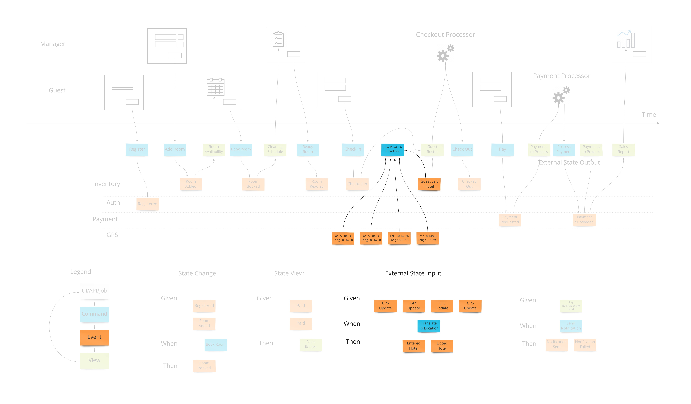

Frequentemente, as traduções são simples o suficiente para serem representadas como visualizações que obtêm suas informações de eventos externos. Se não os usarmos como partes "dadas" dos testes, os valores que eles armazenam nesse modelo de exibição são simplesmente representados nos parâmetros de comando em nossos testes de mudança de estado.

### Automação

Nosso sistema precisará se comunicar com serviços externos. Quando os hóspedes do nosso hotel estão pagando pela estadia no momento do check-out, nosso sistema faz uma chamada para um processador de pagamentos. Podemos fazer o conceito de como isso ocorre com a ideia de uma “lista de tarefas” para algum processador do nosso sistema. Esta lista de tarefas mostra as tarefas que precisamos concluir. Nosso processador percorre essa lista de tempos em tempos (podem ser milissegundos ou dias) e envia um comando para o sistema externo processar o pagamento, por exemplo. A resposta do sistema externo é então traduzida em um evento que armazenamos em nosso sistema. Dessa forma, mantemos os blocos de construção que usamos em nosso sistema como algo significativo para nós.

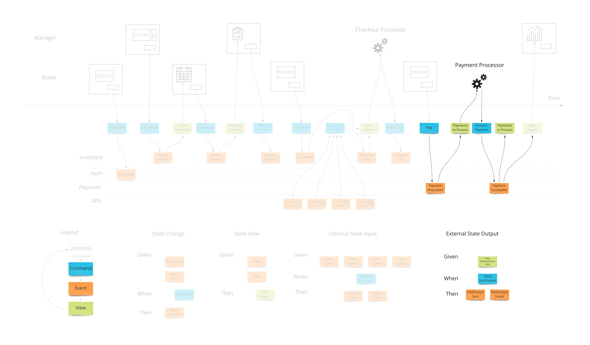

Mostramos isso colocando um processador no topo do nosso projeto que contém os wireframes. Isso mostra que há coisas que não são evidentes na tela, mas estão acontecendo nos bastidores. Um usuário pode esperar que um ícone giratório indique um atraso devido a tarefas em segundo plano que precisam ser concluídas. A especificação para isso tem a forma de “Dado: uma visão das tarefas a serem executadas, quando este comando é iniciado para cada item, então esses eventos são esperados de volta”.

Na realidade, eles podem ser implementados de várias maneiras diferentes, como filas, construções reativas ou em tempo real. Eles podem até ser listas de tarefas manuais que nossos funcionários usam. O objetivo aqui é comunicar como nosso sistema se comunica com o mundo exterior quando precisa afetá-lo.

## Formato do Workshop - Os 7 Passos

A modelagem de eventos é feita em 7 etapas. Já explicamos o objetivo final. Então, vamos voltar ao início e mostrar como construir o projeto:

### 1. Brain Storming

Temos alguém para explicar os objetivos do projeto e outras informações. Os participantes então visualizam como o sistema se pareceria e se comportaria. Eles registram todos os eventos que podem conceber que tenham acontecido. Aqui introduzimos gentilmente o conceito de que apenas eventos de mudança de estado devem ser especificados. Frequentemente, as pessoas nomearão “calendário visualizado pelos hóspedes para disponibilidade de quartos”. Nós os deixamos de lado por enquanto - eles não são eventos.

### 2. O Enredo

Agora a tarefa é criar uma história plausível feita desses eventos. Então eles são organizados em uma linha e todos revisam essa linha do tempo para entender que isso faz sentido como eventos que acontecem em ordem.

### 3. O Story Board

Em seguida, os wireframes ou maquetes da história são necessários para abordar aqueles que são aprendizes visuais. Mais importante, cada campo deve ser representado de forma que o projeto do sistema tenha a fonte e o destino das informações representadas da perspectiva do usuário.

### 3.1. Planejamento da UX de forma simultânea

Os wireframes geralmente são colocados no topo do projeto. Eles podem ser divididos em raias separadas para mostrar o que cada usuário vê se houver mais de um. Não há telas que aparecem umas sobre as outras, pois precisamos capturar cada alteração no estado do sistema como uma fatia vertical separada do projeto. A ordem diferente pode ser mostrada nas várias especificações. Se for essencial para o sistema ou muito importante para se comunicar, fluxos de trabalho alternativos precisarão ser adicionados ao projeto. Isso faz parte da última etapa que mostra a organização, mas pode ser feito antes se for útil.

### 4. Identificando os "inputs"

Na seção anterior, vimos que precisamos mostrar como habilitamos o usuário a alterar o estado do sistema. Esta é geralmente a etapa em que fazemos a introdução dessas caixas azuis. Cada vez que um evento é armazenado devido a uma ação do usuário, nós o vinculamos à interface do usuário por um comando que mostra o que estamos obtendo da tela ou implicitamente do estado do cliente, se for um aplicativo da web.

### 5. Identificando os "outputs"

Olhando novamente para nossos objetivos para o projeto, agora temos que vincular as informações acumuladas armazenando eventos de volta à interface do usuário por meio de visualizações (também conhecidas como modelos de leitura). Podem ser coisas como a visualização do calendário em nosso sistema hoteleiro, que mostrará a disponibilidade de quartos quando um usuário estiver procurando reservar um quarto.

### 6. Aplicando a Lei de Conway

Agora que sabemos como as informações entram e saem do nosso sistema, podemos começar a organizar os próprios eventos em raias. Precisamos fazer isso para permitir que o sistema exista como um conjunto de partes autônomas que equipes separadas podem possuir. Isso permite que a especialização aconteça em um nível que controlamos, em vez de sair da composição das equipes. (Veja a Lei de Conway de Mel Conway).

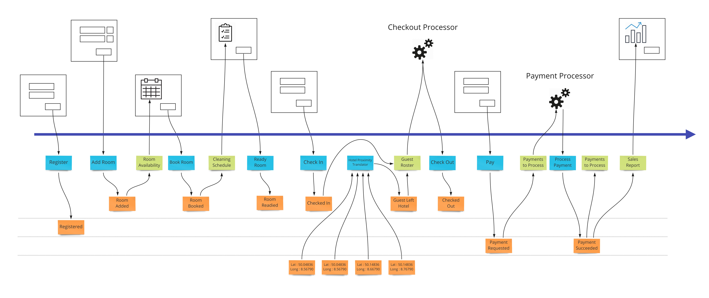

### 7. Elaborar Cenários
Cada etapa do fluxo de trabalho está vinculada a um comando ou a um modelo de visualização/leitura. As especificações foram explicadas anteriormente. Como os fazemos ainda é colaborativo com todos os participantes no mesmo espaço. Um Give-When-Then ou Given-Then pode ser construído um após o outro muito rapidamente enquanto é revisado por vários representantes de papéis. Isso permite que o que é tradicionalmente feito como escrita de história de usuário por um proprietário de produto dedicado isoladamente em um formato de texto, seja feito visualmente em uma quantidade muito pequena de tempo de forma colaborativa. O que é muito crítico aqui é que cada especificação está vinculada a exatamente um comando ou visualização.

## Verificação de integridade

Neste momento, o modelo de evento deve ter todos os campos contabilizados. Toda informação tem que ter uma origem e um destino. Os eventos devem facilitar essa transição e manter os campos necessários para isso. Esse rigor é o que é necessário para obter o máximo de benefícios da técnica.

Uma variação disso é quando não fazemos essa verificação final e contamos com a absorção dos custos de retrabalho. Existem cenários em que isso é desejado.

# Gerenciamento de projetos

O resultado final do exercício, se concluído, é um conjunto de projetos muito pequenos definidos por todos os cenários para cada etapa do fluxo de trabalho. Eles estão em um formato que permite que sejam traduzidos diretamente para o que os desenvolvedores usarão para fazer seus testes de unidade. Eles também são acoplados às etapas de fluxo de trabalho adjacentes apenas pelo contrato.

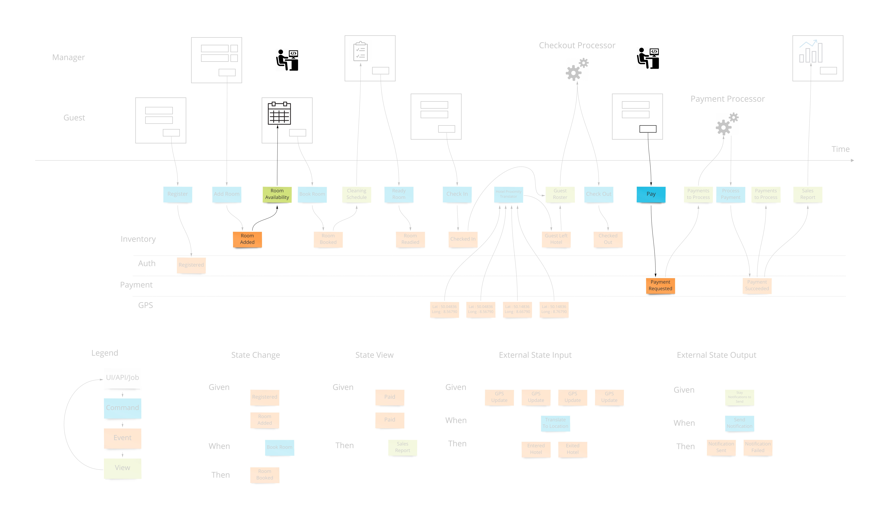

## Contratos Fortes

Muitos problemas de gerenciamento de projetos, negócios e coordenação são mitigados pelo fato de termos feito contratos explícitos quanto ao formato das informações de quando iniciamos uma etapa específica do fluxo de trabalho e qual é o formato dos dados quando ele é concluído. Essas pré e pós-condições são o que permite que o trabalho seja concluído em relativo isolamento e posteriormente se encaixe com as etapas adjacentes conforme projetado.

## Curva de custo plana

O maior impacto do uso da Modelagem de Eventos é a curva de custo plana do custo médio do recurso. Isso se deve ao fato de que o esforço de construção de cada etapa do fluxo de trabalho não é impactado pelo desenvolvimento de outros fluxos de trabalho. Uma coisa importante a entender é que uma etapa do fluxo de trabalho é considerada repetida no modelo de evento se usar o mesmo comando ou exibição.

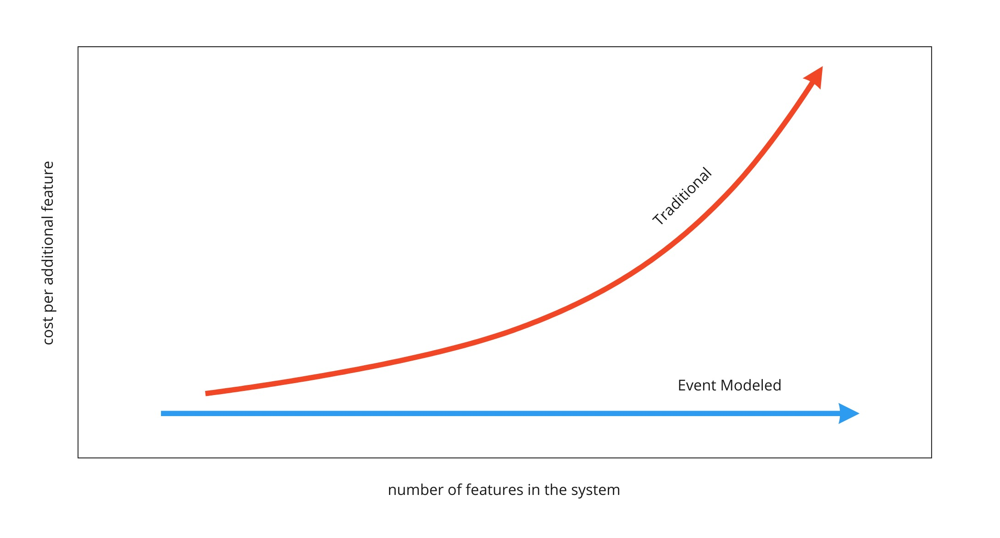

O impacto disso é muito abrangente porque é o que muda o desenvolvimento de software de volta para uma prática de engenharia. É o que faz a criação de um sistema de informação funcionar como a construção de uma casa. Os recursos podem ser criados em qualquer ordem. O desenvolvimento tradicional não pode depender de estimativas porque se o recurso é desenvolvido no início ou mais tarde no projeto, afeta a quantidade de trabalho necessária. Repriorizar o trabalho torna qualquer estimativa anterior não confiável.

## Feito é "Feito Certo"

Quando uma etapa do fluxo de trabalho é implementada, o ato de implementar qualquer outra etapa do fluxo de trabalho não causa a necessidade de revisitar essa etapa do fluxo de trabalho já concluída. É a razão pela qual a curva de custo de recurso constante pode ser realizada.

## Realizar estimativas sem de "fato" estimar

Com uma curva de custo constante, o esforço de implementação de uma organização pode simplesmente ser medido em muitos recursos ao longo do tempo. Esta é uma maneira imparcial de determinar empiricamente a velocidade das equipes. Esses números são então usados para definir o escopo, programar e custear projetos futuros.

### Nota Técnica sobre Desenvolvimento Orientado a Testes

Este é o impacto da adoção de práticas ágeis na indústria para colocar band-aids sobre a questão central da falta de design. Como o escopo de cada conjunto de requisitos agora é por etapa do fluxo de trabalho, a etapa de refatoração do TDD não afeta outras etapas do fluxo de trabalho no modelo de evento. Quando não temos um modelo de evento, a refatoração é irrestrita e as partes do trabalho concluídas anteriormente precisam ser ajustadas. Quanto mais trabalho já está concluído, mais ele precisa ser revisado e ajustado a cada nova adição à medida que construímos a solução.

## Subcontratos

A curva de custo constante dá a oportunidade de fazer projetos de custo fixo. Uma vez estabelecida uma velocidade para uma equipe, você tem o custo do software para sua organização. Com esse número, agora você pode definir o preço que está disposto a pagar aos contratados por cada etapa do fluxo de trabalho que concluírem.

## Garantias

Como cada etapa do fluxo de trabalho é protegida de ser afetada por outras etapas do fluxo de trabalho, quaisquer deficiências devem ser garantidas por quem as está entregando com trabalho não faturável. Portanto, no caso de um subcontratado fazer um trabalho ruim apenas para fazer mais itens faturáveis rapidamente, ele terá que dedicar as próximas horas de trabalho para corrigir as deficiências do trabalho já feito anteriormente. Isso equilibra sua taxa efetiva de pagamento porque eles não estão trabalhando em novos produtos.

Isso pode ser realizado por períodos mais longos no envolvimento de um funcionário, disponibilizando essas métricas por meio de diferentes pontos de verificação de desempenho.

Devido ao pagamento efetivo auto-ajustável à capacidade do indivíduo, é também uma forma de integrar novos funcionários e remunerá-los de forma justa enquanto estão no estágio probatório do contrato. Esse processo de contrato para contratação remove o processo de entrevista subjetivo e amplamente ineficaz para cargos técnicos.

## Priorização

Mover o trabalho em um cronograma sobre quais etapas serão implementadas primeiro é feito sem alterar os custos estimados de cada item. Isso garante que a priorização do trabalho também não tenha impacto no custo total. A curva de custo constante é necessária para permitir essa “agilidade” de repriorização de funcionalidades.

## Mudar a gestão

Quando os planos mudam, simplesmente ajustamos o modelo do evento. Isso geralmente é feito apenas copiando o atual e ajustando. Agora podemos ver onde estão as diferenças. Se uma nova informação for adicionada a um evento, isso constituirá uma nova versão do fluxo de trabalho que o cria. Mesmo com as vistas. Se ainda não foram implementados, não alteram nossa estimativa. Se já estiverem implementados, adicionam outra unidade de trabalho ao nosso plano porque é considerado um substituto. Existem mais algumas regras sobre isso. O resultado final é um guia definitivo para o gerenciamento de mudanças.

## Segurança

Com um modelo de evento, a solução mostra exatamente onde, e igualmente importante, quando os dados confidenciais cruzam os limites. Com as auditorias tradicionais, o número de entrevistas com a equipe consumia muito tempo e corria o risco de perder áreas importantes. As preocupações de segurança são abordadas com mais responsabilidade quando os aplicativos têm um modelo de evento para referenciar.

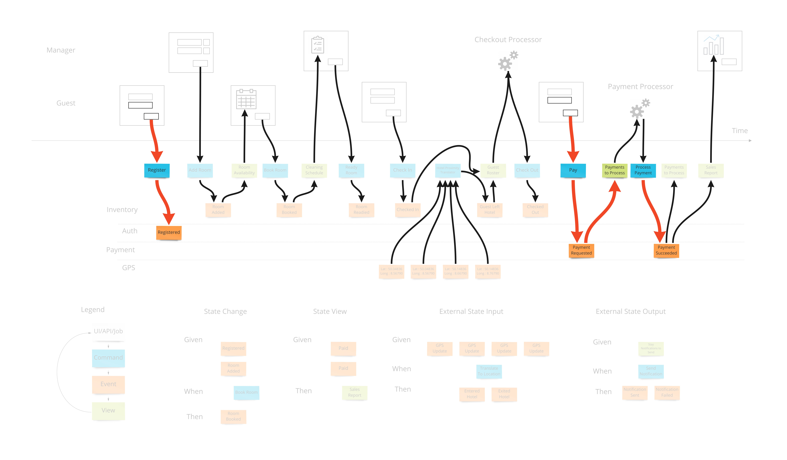

## Sistemas Legados

A maioria dos cenários que as organizações reais enfrentam é onde um sistema já está em vigor. A principal maneira de lidar com um sistema que é difícil de gerenciar devido à complexidade e à falta de compreensão é reescrevê-lo ou refatorá-lo durante a execução. Ambos são muito caros.

Existe uma terceira opção menos arriscada: Congelar o sistema antigo. Com a aceitação adequada, a organização pode concordar em não alterar o sistema existente. Em vez disso, lidar com bugs e adicionar novas funcionalidades é feito paralelamente como uma solução secundária.

Os eventos podem ser coletados do banco de dados do sistema antigo e fazer visualizações desse estado - empregando o padrão translate descrito anteriormente. O redirecionamento da válvula Y da ação do usuário pode adicionar novas funcionalidades na solução secundária. Um exemplo que corrige um bug (observe que usamos o padrão de integração externa e estende o sistema antigo para adicionar fotos de perfil é mostrado aqui):

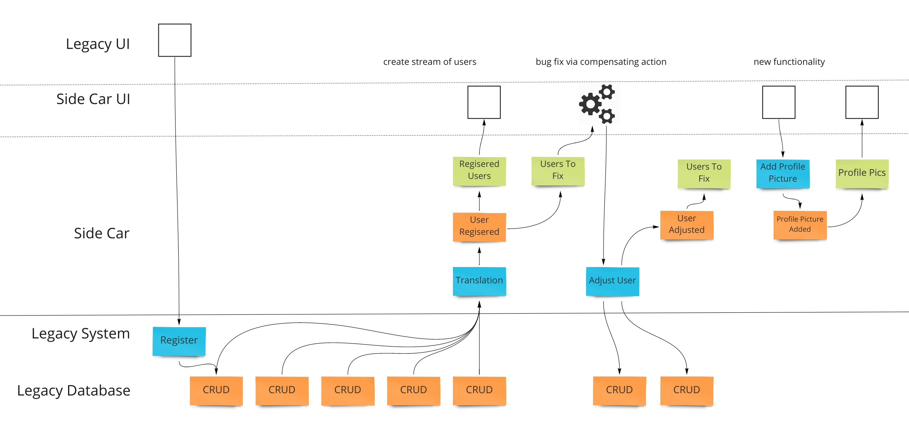

Esse padrão permite que uma organização pare de colocar energia no sistema existente abaixo do ideal e seja liberada da entrega de valor por meio dos padrões que permitem os benefícios do Modelo de Evento.

## Conclusão por enquanto

A modelagem de eventos está mudando a forma como os sistemas de informação são construídos. Com padrões repetíveis simples, os sistemas de informação são tão previsíveis quanto os esforços de engenharia deveriam ser